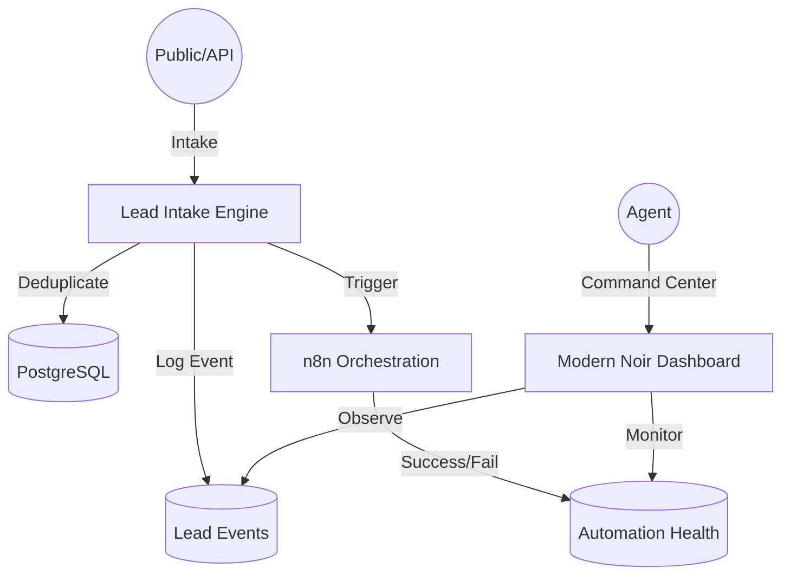

# Lead Operations Intelligence Platform

A production-grade, high-density operational command center designed to optimize real estate lead lifecycles, monitor response SLAs, and provide deep visibility into automation health.


## 🚀 Overview

The **Lead Operations Intelligence Platform** is an enterprise-focused evolution of traditional lead management. It shifts the focus from simple storage to **operational intelligence**, using event-driven architecture to detect lead decay, manage response deadlines, and monitor the health of distributed workflows.

### Core Intelligence Vectors
- **Lead Decay Monitoring**: Automatic classification (HOT, WARM, COLD, HIGH_RISK) based on inactivity and response deltas.
- **Urgency Scoring Engine**: A 0-100 scoring system that prioritizes the operational queue based on revenue risk.
- **SLA Visibility**: Real-time tracking of response deadlines with automated "High Risk" escalation for breached SLAs.
- **Automation Observability**: Infrastructure-style logging for n8n webhooks, tracking success rates, failures, and retries.
- **Operational Deduplication**: Collision detection for incoming lead data to maintain event stream integrity.

---

## 🏗️ Architecture

The system utilizes a modular, event-driven architecture with a focus on observability and state integrity.



### Technical Implementation
- **Fire-and-Forget Orchestration**: Webhook triggers are non-blocking for the end-user but fully logged in the `automation_events` table for operational visibility.
- **SLA Timers**: Every lead is assigned a `response_deadline` upon intake, triggering visual alerts in the Command Center if breached.
- **Operational Timeline**: Every state change (Intake -> Contacted) generates an immutable event record for auditability.

---

## 🛠️ Tech Stack

- **Frontend**: Next.js 15+, TypeScript, Tailwind CSS 4.0, Shadcn/UI.
- **Backend**: Supabase (Postgres, Auth, RLS).
- **Automation**: n8n Workflow Orchestration.
- **Design**: "Modern Noir" Monochrome Aesthetic (Linear/Vercel inspired).

---

## 🔒 Security & Operations

- **Auth Protection**: Strict session verification inside all Server Actions.
- **Agent Isolation**: RLS policies ensure data is scoped to the operational team.
- **Resilient Webhooks**: Error handling and retry logging for all outbound orchestrations.

---

## 🚦 Getting Started

### 1. Infrastructure Setup
Execute the upgraded `supabase/schema.sql` to initialize the operational intelligence tables and enums.

### 2. Environment Configuration
Required variables in `.env.local`:
```env
NEXT_PUBLIC_SUPABASE_URL=your_url
NEXT_PUBLIC_SUPABASE_ANON_KEY=your_key
SUPABASE_SERVICE_ROLE_KEY=your_service_key
N8N_WEBHOOK_URL=your_n8n_url
```

### 3. n8n Orchestration
Import your workflows and ensure they send a POST callback to the `/api/webhooks/automation` endpoint (future expansion) to synchronize state.

---

## 📈 Scaling Considerations

- **Redis Caching**: For high-volume intake, integrate Upstash Redis for global rate-limiting.
- **Queueing**: Move from fire-and-forget `fetch` to a durable queue (e.g., Inngest) for 100% delivery guarantees.
- **AI Scoring**: Future integration of LLM-based sentiment analysis for automated urgency score adjustment.

---

## 📄 License
MIT
